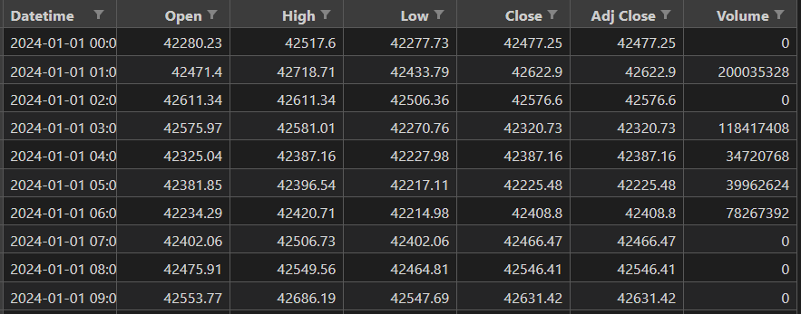
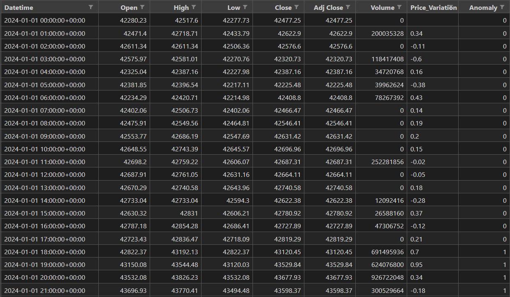
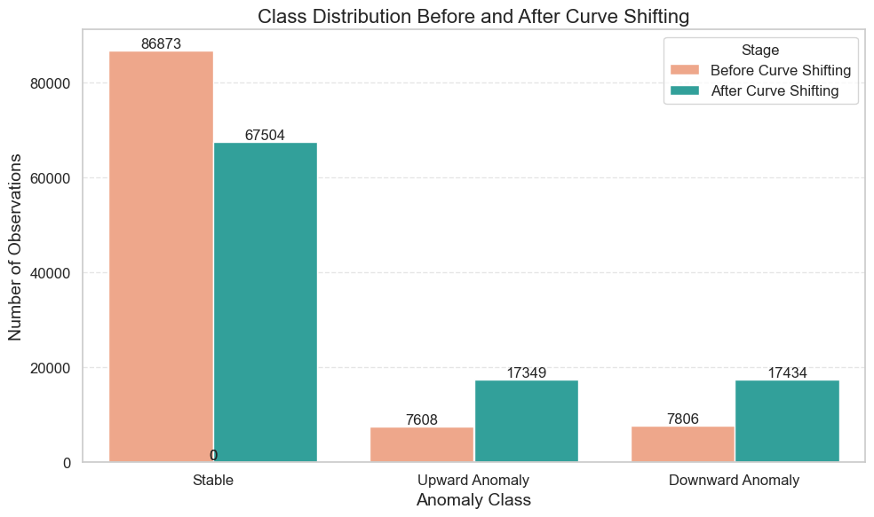
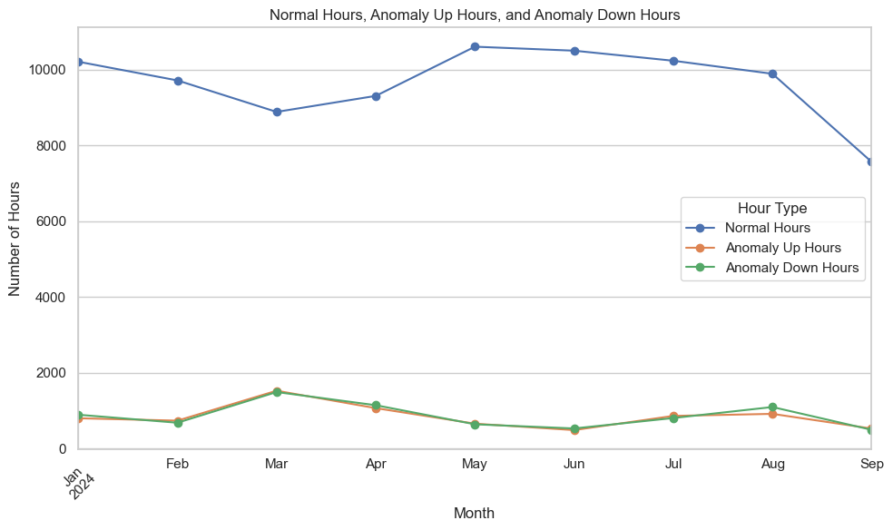
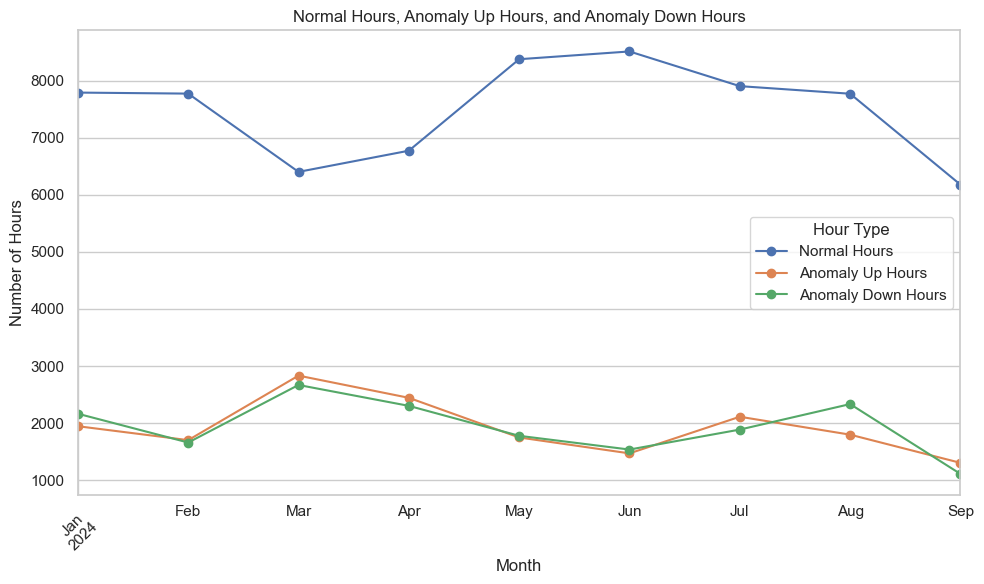
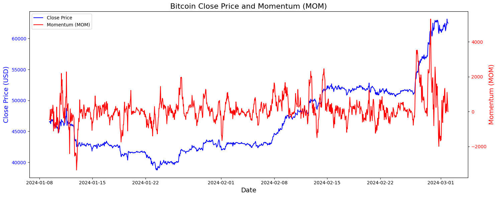
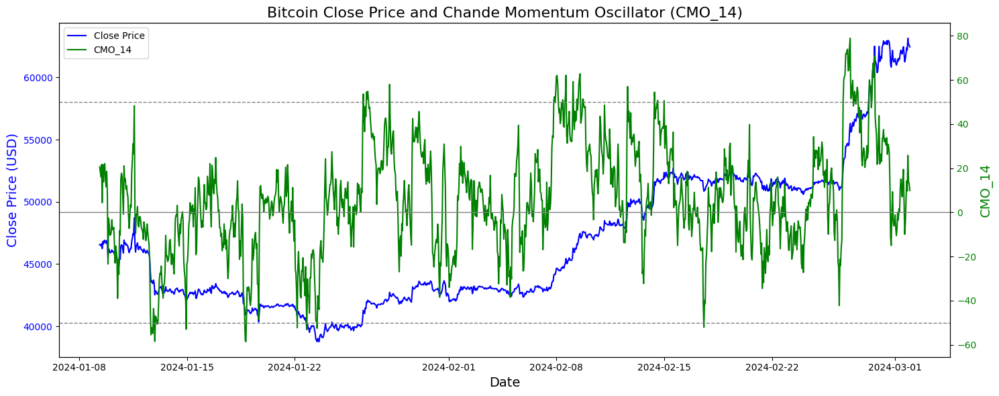
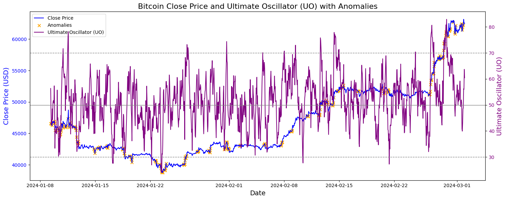

# Crypto-Anomaly-Detection

## Overview 

This project predicts anomalies in cryptocurrency markets using machine learning and time-series analysis. It identifies unusual price movements and deviations from normal patterns, offering real-time detection of potential market anomalies for further analysis.

## Table of Contents
- [Code Directory](#code-directory)
- [Dataset Acquisition](#dataset-acquisition)
- [Dataset Construction](#dataset-construction)
- [Technical Indicators Integration](#technical-indicators-integration)
- [Data Visualization](#data-visualization)


### Code directory
```
Crypto-Anomaly-Detection
    ├── conda          # All the conda environments
    ├── data           # All the data
    ├── images         # All the images
    ├── notebooks      # All the notebooks
    ├── src            # All the scripts for the analysis
    ├── .gitignore
    ├── README.md
    └── requirements.txt

```

## Dataset Acquisition
The first step to exploit our work is to select a dataset that best suits our needs.
The decision was about crypocurrencies due to their higher volatilty with respect to stock market. 

As we’re going to see in the next sections, we will need to use some technical analysis indicators which are commonly used by traders to decide whether to sell or buy an asset. Traders use two strategies:
1. The first is the use of these **technical indicators** to determine through graphs of the price possible situation where the asset they’re examining is oversold or overbought; 
2. The other strategy that traders use is **fundamental analysis**, this strategy is used mostly with stocks prices and aims at analyzing the main characteristics of a firm, for instance, the revenue, total debt, price/earnings ratio, etc.

It is behind the scope of this analysis to investigate deeply all those analysis indicator.

The data were acquired from [Yahoo Finance](https://finance.yahoo.com/) using the [yfinance](https://github.com/ranaroussi/yfinance) python package. To get as much sample as possible the price variation of 1 hour has been considered. 

Below the features extracted, from each single crypto, in this data acquisition steps:
- Date
- Open price for the hour
- Close price for that hour
- The Higest price in the hour
- The Lowest price in the hour
- The volume of crypto traded in the hour



After all the cryptos' information are acquired a data cleaning pahse is performed, replacing all the missing values with the previous available value. 

Below an example of how execute the data_acquisition.py script, additional information can be found looking at the first row of the script. 

```bash
    python src/dataset_acquisition.py --tickers BTC-USD BTS-USD DGB-USD XMR-USD DASH-USD DOGE-USD ETH-USD LTC-USD MAID-USD MONA-USD NAV-USD VTC-USD XCP-USD XRP-USD SYS-USD XLM-USD --period ytd --interval 1h --output_folder data/raw
```

## Dataset Construction

After acquiring and cleaning the data, the next step is to construct the dataset by labeling anomalies based on price variations.

### Anomaly Definition

An anomaly is defined based on the percentage change in the close price of each hour:

- **Upward Anomaly**: If the price variation is greater than 1%, we label the previous hour as an upward anomaly.
- **Downward Anomaly**: If the price variation is less than -1%, we label the previous hour as a downward anomaly.
- **Stable**: If the price variation is between -1% and 1%, we label it as stable.

This labeling helps in identifying significant price movements in the market.



### Curve Shifting Technique

Labeling only the hour before a price variation as anomalous wasn't sufficient for our analysis. To improve the results, we applied a technique called *curve shifting*.

**Curve Shifting involves** labeling the previous n hours preceding any anomaly. In our case, we chose a curve shifting of 4 hours. This means that the 4 hours leading up to an anomaly are also labeled as anomalies.

This approach accounts for patterns or signals that may occur before significant price movements, allowing our models to learn from the lead-up to anomalies.

To visualize the impact of curve shifting on the class distribution, we plotted the number of observations for each class before and after applying curve shifting.

#### Bar Plot of Class Distribution:



#### Line Plot of Class Trend Over Time:

The image below shows the trends for the 3 classes (stable, upward and downward anomaly) in the considered time period **before** the application of the curve shifting: 



The image below shows the trends for the 3 classes (stable, upward and downward anomaly) in the considered time period **after** the application of the curve shifting: 



These plots illustrate that, after applying curve shifting, the dataset becomes more balanced, with more samples labeled as anomalies. This helps in training machine learning models more effectively by providing sufficient examples of each class.

### Executing the Dataset Construction Script

Below is an example of how to execute the `dataset_construction.py` script from the root folder, which processes the raw data to label anomalies and apply curve shifting.

```bash
    python src/dataset_construction.py --input_folder data/raw --output_folder data/processed --threshold 1.0 --shift_hours 4
```

- --input_folder: Path to the folder containing the raw CSV files.
- --output_folder: Path where the processed CSV files will be saved.
- --threshold: Percentage threshold for anomaly detection (e.g., 1.0 for 1% price variation).
- --shift_hours: Number of hours to shift the anomaly labels backward (e.g., 4).

## Technical Indicators Integration

After constructing and labeling our dataset, we enhance it by integrating various technical analysis indicators commonly used in trading. These indicators help capture market trends and momentum, providing additional features for our anomaly detection models.

### Python Script: integrate_indicators.py

We created a Python script `integrate_indicators.py` that processes each cryptocurrency CSV file and calculates technical indicators using the [pandas_ta](https://github.com/twopirllc/pandas-ta?tab=readme-ov-file) library.

**Calculated Indicators**
- Simple Moving Average (SMA): Periods of 5, 12, 13, 14, 20, 21, 26, 30, 50, 100, 200
- Exponential Moving Average (EMA): Same periods as SMA
- Moving Average Convergence Divergence (MACD)
- Relative Strength Index (RSI): Same periods as SMA
- Momentum (MOM)
- Chande Momentum Oscillator (CMO): Same periods as SMA
- Ultimate Oscillator (UO)
- Bollinger Bands (BBANDS)
- Volume Weighted Average Price (VWAP)

#### Script execution

```bash
    python src/integrate_indicators.py --input_folder data/processed --output_folder data/with_indicators
```

- --input_folder: Path to the folder containing the processed CSV files.
- --output_folder: Path where the updated CSV files with technical indicators will be saved.

### Handling Missing Values

Due to the nature of technical indicators, some initial rows in the dataset may have missing values (`NaN`) because the indicators require a certain number of periods to calculate their initial values. To handle these missing values, we drop the initial rows where the indicators cannot be computed.

## Data Visualization

To gain insights from the integrated technical indicators, we plotted several indicators alongside the Bitcoin price to understand their behavior and potential signals.

### Momentum (MOM) Plot

We plotted the Momentum (MOM) indicator alongside the Bitcoin close price to observe how momentum correlates with price movements.




Momentum (MOM): Positive values indicate upward momentum, while negative values indicate downward momentum. Divergences between MOM and price can signal potential reversals.

### Chande Momentum Oscillator (CMO) Plot

We plotted the Chande Momentum Oscillator (CMO) with a period of 14 alongside the Bitcoin close price to identify overbought and oversold conditions.




Chande Momentum Oscillator (CMO): Values above +50 may indicate overbought conditions; values below -50 may indicate oversold conditions.

### Ultimate Oscillator (UO) Plot

We plotted the Ultimate Oscillator (UO) alongside the Bitcoin close price to detect potential trend reversals based on multiple timeframes.




Ultimate Oscillator (UO): Values above 70 suggest overbought conditions; values below 30 suggest oversold conditions. Divergences can signal trend reversals.

## Contributing

If you want to contribute to this project, please fork the repository and submit a pull request. For major changes, please open an issue first to discuss what you would like to change.

## License

This project is licensed under the [GNU GENERAL PUBLIC LICENSE](LICENSE) - see the `LICENSE` file for details.